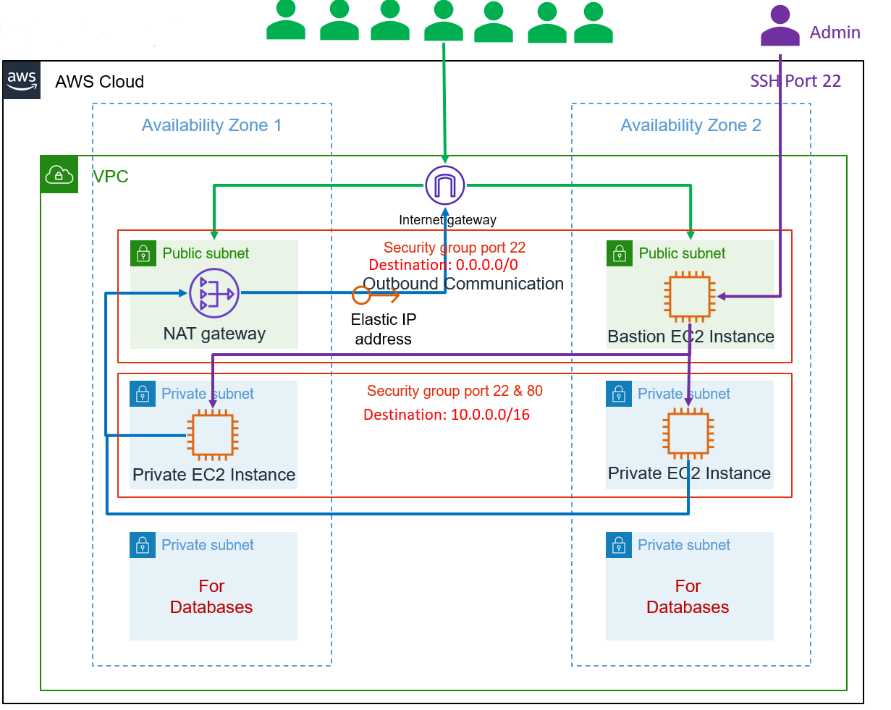

# Build AWS EC2 Instances, Security Groups using Terraform



## Step-01: Introduction
### Terraform Modules we will use
- [terraform-aws-modules/vpc/aws](https://registry.terraform.io/modules/terraform-aws-modules/vpc/aws/latest)
- [terraform-aws-modules/security-group/aws](https://registry.terraform.io/modules/terraform-aws-modules/security-group/aws/latest)
- [terraform-aws-modules/ec2-instance/aws](https://registry.terraform.io/modules/terraform-aws-modules/ec2-instance/aws/latest)

### Terraform New Concepts we will introduce
- [aws_eip](https://registry.terraform.io/providers/hashicorp/aws/latest/docs/resources/eip)
- [null_resource](https://registry.terraform.io/providers/hashicorp/null/latest/docs/resources/resource)
- [file provisioner](https://www.terraform.io/docs/language/resources/provisioners/file.html)
- [remote-exec provisioner](https://www.terraform.io/docs/language/resources/provisioners/remote-exec.html)
- [local-exec provisioner](https://www.terraform.io/docs/language/resources/provisioners/local-exec.html)
- [depends_on Meta-Argument](https://www.terraform.io/docs/language/meta-arguments/depends_on.html)

### What are we going to implement? 
- Create VPC with 3-Tier Architecture (Web, App, and DB)
- Create AWS Security Group Terraform Module and define HTTP port 80, 22 inbound rule for entire internet access `0.0.0.0/0`
- Create Multiple EC2 Instances in VPC Private Subnets and install software
- Create EC2 Instance in VPC Public Subnet `Bastion Host`
- Create Elastic IP for `Bastion Host` EC2 Instance
- Create `null_resource` with Terraform Provisioners:
  - File Provisioner
  - Remote-exec Provisioner
  - Local-exec Provisioner

## Pre-requisite
- Copy your AWS EC2 Key pair `terraform-key.pem` into `private-key` folder
- Create a folder named `local-exec-output-files`

## Step-02: Terraform Configuration Updates
### c1-versions.tf
```t
terraform {
  required_version = ">= 1.6"
  required_providers {
    aws = {
      source  = "hashicorp/aws"
      version = ">= 5.0"
    }
    null = {
      source = "hashicorp/null"
      version = "~> 3.0"
    }
  }
}
```

### c4-02-vpc-module.tf
```t
  source  = "terraform-aws-modules/vpc/aws"
  version = "5.2.0"
```

### c5-02-securitygroup-outputs.tf
```t
output "public_bastion_sg_group_id" {
  description = "The ID of the security group"
  value       = module.public_bastion_sg.security_group_id
}
```

### c5-03-securitygroup-bastionsg.tf & c5-04-securitygroup-privatesg.tf
```t
  source  = "terraform-aws-modules/security-group/aws"
  version = "5.1.0"
```

### c7-03-ec2instance-bastion.tf
```t
  source  = "terraform-aws-modules/ec2-instance/aws"
  version = "5.5.0"
```

### c7-04-ec2instance-private.tf (Updated for `for_each`)
```t
  source  = "terraform-aws-modules/ec2-instance/aws"
  version = "5.5.0"  

  for_each = toset(["0", "1"])
  subnet_id =  element(module.vpc.private_subnets, tonumber(each.key))
  vpc_security_group_ids = [module.private_sg.security_group_id]
```

### c7-02-ec2instance-outputs.tf
```t
output "ec2_private_instance_ids" {
  description = "List of IDs of instances"
  value = [for ec2private in module.ec2_private: ec2private.id ]
}

output "ec2_private_ip" {
  description = "List of private IP addresses assigned to the instances"
  value = [for ec2private in module.ec2_private: ec2private.private_ip ]
}
```

### c8-elasticip.tf
```t
resource "aws_eip" "bastion_eip" {
  depends_on = [module.ec2_public]
  instance = module.ec2_public.id
  domain = "vpc"
  tags = local.common_tags  
}
```

## Step-09: Execute Terraform Commands
```t
terraform init
terraform validate
terraform plan
terraform apply -auto-approve
```

## Step-10: Connect to Bastion EC2 Instance and Test
```t
ssh -i private-key/terraform-key.pem ec2-user@<PUBLIC_IP_FOR_BASTION_HOST>

curl  http://<Private-Instance-1-Private-IP>
curl  http://<Private-Instance-2-Private-IP>

ssh -i /tmp/terraform-key.pem ec2-user@<Private-Instance-1-Private-IP>
cd /var/www/html
ls -lrta
curl http://169.254.169.254/latest/user-data 
```

## Step-11: Clean-Up
```t
terraform destroy -auto-approve
rm -rf .terraform*
rm -rf terraform.tfstate*